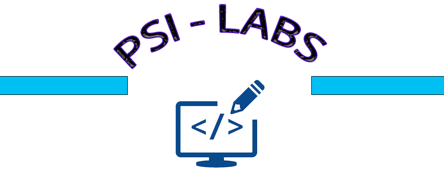

<h2 align="center">
 
  
   
     
        A TCP_Multithreading program
   
</h2>

---

### What is TCP_Multithreading ?

TCP_Multithreading  is a program that allow you to create a TCP server on your local machine
and/or clients with a specified port. This is the basic interaction with Sockets between server-clients
using the Socket API of JAVA.

_This is a project for PSI course !_

### How can we use is TCP_Multithreading ?

- First of all, you need to run the JAVA application.
- Then, you will have to choose what is this terminal for (Server or Client).
- Then select a port number, which is the port that will be used for the socket (Server or Client).

You can follow the instructions you can see on the terminal. Don't worry :)

**Versions history:**

|      Version       |             Date            |         Java version         |        Gradle version       |
|--------------------|-----------------------------|------------------------------|-----------------------------|
| **1.0.0**          | 13/03/2023                  | Java 8                       |        8.0                  |

-----